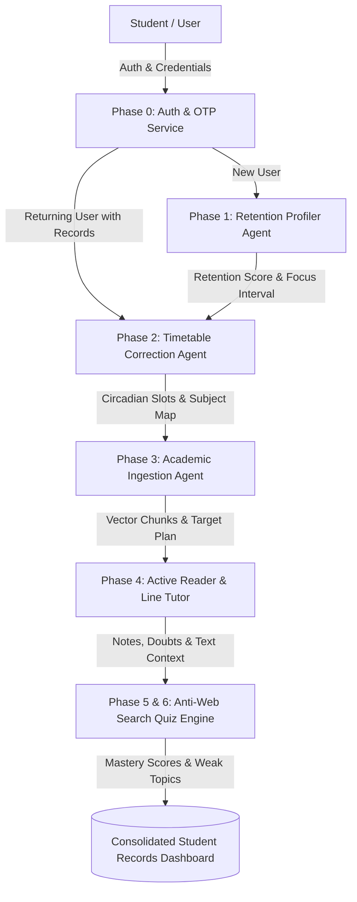

# 🧠 StudyPrep.AI — Autonomous Multi-Agent Academic Preparation System

<div align="center">


**An intelligent, neurocognitively grounded multi-agent study operating system that measures student attention endurance, calibrates circadian timetables, ingests academic material, provides line-level contextual tutoring, and tests deep conceptual mastery with anti-web search active recall.**

[Architecture](#-multi-agent-system-architecture) • [Neurocognitive Foundations](#-neurocognitive-scientific-foundations) • [Six Core Phases](#-the-six-integrated-phases) • [Quickstart](#-quickstart-guide) • [Database Schema](#-database-schema)

</div>

---

## 🌟 Key Highlights & Innovations

1. **Empirical Retention Profiling**: Replaces guesswork with calibrated neurocognitive batteries (SART, Digit Span Working Memory, Delayed Recall, Dopamine Tolerance).
2. **Circadian Timetable Correction**: Enforces circadian biology, ultradian rhythms, nutrition buffers, and eliminates delusional cramming.
3. **Active Timetable State Management**: Returning users are instantly recognized, presented with their active schedule, and can choose to proceed directly to Phase 3, track active focus sessions, or recalibrate a new timetable.
4. **Distraction-Free Active Reader**: Line-level contextual tutor with 4 interchangeable personas (Socratic, First Principles, ELI5, Exam-Cram) directly over PDF text.
5. **Anti-Web Search Quiz Engine**: Generates hallucination-resistant, passage-specific questions that cannot be solved by generic Google searches.
6. **Unified Student Records Modal**: Full consolidated real-time dashboard displaying retention scores, active timetables, margin notes, bookmarks, daily target completions, and quiz histories.
7. **Cinematic Breaking Bad Themed UI**: Dark-first glassmorphism design with atmospheric animations, chemical smoke particles, and laboratory aesthetic.

---

## 🤖 Multi-Agent System Architecture



| Phase & Agent | Responsibility | Core Mechanism & Research Foundation |
| :--- | :--- | :--- |
| **Phase 0: Auth & Records** | Authentication, OTP Dispatch, Record Sync | Supabase Auth + Local SHA-256 fallback, 6-digit Email/SMS OTP, Google One-Click Auth, Consolidated Student Records |
| **Phase 1: Retention Profiler** | Measures attention endurance & break intervals | Multi-signal behavioral scoring: SART Vigilance, Digit Span Memory, Delayed Recall, Reels Tolerance, Metacognitive Optimism Calibration |
| **Phase 2: Timetable Corrector** | Calibrates realistic, non-delusional schedules | Circadian rhythm constraints, post-wake cortisol buffers, non-uniform study blocks, nutrition downtime, live countdown focus timers, .ics export |
| **Phase 3: Content Ingestion** | Ingests textbooks and plans daily targets | Academic document parsing, semantic vector chunking, retention-adjusted daily page targeting |
| **Phase 4: In-App Reader & QA** | Distraction-free reading & line-level tutor | Page-scoped similarity search, in-line text margin notes & bookmarks, 4 pedagogical personas (Socratic, First Principles, ELI5, Exam Cram) |
| **Phase 5 & 6: Anti-Web Search Quiz** | Active recall & Feynman mastery verification | Passage-specific question synthesis weighting student annotated sections, instant misconception remediation, historical attempt tracking |

---

## 🧪 Neurocognitive Scientific Foundations

The system's core algorithms are grounded in empirical cognitive science and neuropsychology literature:

1. **Sustained Attention to Response Task (SART)** (*Robertson et al., 1997*):
   - Measures executive inhibitory control (commission errors on No-Go trials) and sustained prefrontal vigilance.
2. **Working Memory Digit Span Buffer** (*Baddeley 1986; Miller 1956*):
   - Quantifies active working memory capacity ($7 \pm 2$ items) essential for multi-step analytical problem-solving.
3. **Delayed Free Recall & Ebbinghaus Decay** (*Roediger & Karpicke, 2006; Ebbinghaus 1885*):
   - Evaluates long-term memory retrieval without cues following working memory buffer flush.
4. **Short-Form Video Dopamine Resilience** (*Gazzaley & Rosen, 2016 MIT Press*):
   - Models media multitasking vulnerability and bottom-up attentional capture under low-friction micro-rewards.
5. **Metacognitive Calibration & Optimism Bias Discount** (*Kruger & Dunning, 1999*):
   - Computes the delta between self-reported stamina vs empirical cognitive battery to prevent overambitious scheduling.

---

## 🚀 The Six Integrated Phases

### 🔐 Phase 0: Authentication & Student Records
- **Multi-Channel Registration**: Name, Phone, Email, Password verification with confirm password validation.
- **OTP Verification**: 6-digit OTP delivery simulation with 1-click `[⚡ Auto-Fill & Enter]` in development mode.
- **Google One-Click Authentication**: Instant provisioning with linked student profiles.
- **Consolidated Student Records Dashboard**: Interactive 5-tab modal (Retention Report, Active Timetable, Notes & Bookmarks, Daily Targets, Quiz History) with a non-destructive `"Clear All Study Records"` feature that retains user login credentials.

### 🎯 Phase 1: Retention & Attention Profiling
- 5-step interactive neurocognitive battery:
  1. **SART Vigilance Test**: High-speed numerical stream with No-Go trigger on `3`.
  2. **Digit Span Memory**: Forward recall sequence challenge with dynamic span scaling.
  3. **Delayed Free Recall**: Unprompted retrieval test after distractor flush.
  4. **Short-Form Dopamine Test**: Real-time evaluation of video watch completion and skip reflexes.
  5. **Baseline Habit Survey**: Self-reported study durations and historical series completion rates.
- **Output**: Calibrated composite Retention Score, Focus Tier (e.g., *Deep Focus Master*, *Standard Collegiate Rhythm*), and optimal break interval (e.g., *45m focus / 10m reset*).

### ⏰ Phase 2: Circadian Scheduler & Timetable Correction
- **Active Schedule Detection**: Detects previously calibrated timetables and provides 3 instant choices:
  - 🟢 **Keep Existing Timetable & Proceed to Materials (Phase 3)**
  - 🔵 **View & Track Current Timetable**
  - 🟡 **Recalibrate / Create New Timetable**
- **Circadian Pacing**: Dynamically allocates non-uniform study blocks matching student chronotype, morning peak alertness windows, and meal downtime buffers.
- **Live Focus Tracker**: Interactive countdown timer with Web Audio API chime notifications upon completion.
- **Delusion Scanner**: Audits unrealistic student schedules and demonstrates corrected versions.
- **Calendar Export**: Generates standard RFC 5545 `.ics` files for Google Calendar and Apple Calendar.

### 📚 Phase 3: Academic Content Ingestion
- Ingests PDFs, lecture slides, and course syllabi.
- Semantic vector chunking with target daily page breakdown calibrated to student retention scores.

### 📖 Phase 4: Distraction-Free Active Reader & Line-Level Tutor
- Clean, focused document viewer with real-time synchronized laptop clock.
- **Line-Level Tutor Popover**: Highlight any text to trigger instant explanations across 4 personas:
  - **Socratic Guide**: Asks probing questions to guide discovery.
  - **First Principles**: Derives concepts from fundamental axioms.
  - **ELI5**: Breaks down complex topics using intuitive analogies.
  - **Exam Cram**: Focuses strictly on high-yield exam takeaways.
- **Margin Notes & Bookmarks**: Save custom notes and bookmarks synced directly to DB and local storage.

### 🏆 Phase 5 & 6: Anti-Web Search Quiz & Feynman Mastery
- Generates passage-specific quizzes that cannot be answered via web search engines.
- Assesses conceptual understanding, provides immediate remediation, and logs attempts in the student dashboard.

---

## 🛠️ Tech Stack

- **Backend**: Python 3.9+, FastAPI, SQLAlchemy 2.0 (ORM), Pydantic v2, Uvicorn
- **Database**: SQLite (local development) / PostgreSQL with Supabase (cloud production)
- **Frontend**: React 18, Vite, Lucide Icons, Vanilla CSS Design System
- **Testing**: Pytest, AsyncIO, Coverage

---

## ⚡ Quickstart Guide

### 1. Clone the Repository
```bash
git clone https://github.com/VikasHiremath14/study-prep-ai.git
cd study-prep-ai
```

### 2. Backend Setup
```bash
# Navigate to backend directory
cd backend

# Create and activate virtual environment
python3 -m venv .venv
source .venv/bin/activate  # On Windows: .venv\Scripts\activate

# Install dependencies
pip install -r requirements.txt

# Start FastAPI server
python -m uvicorn backend.app.main:app --host 0.0.0.0 --port 8000 --reload
```
*The FastAPI backend will run on `http://127.0.0.1:8000` with interactive Swagger docs at `http://127.0.0.1:8000/docs`.*

### 3. Frontend Setup
```bash
# In a new terminal, navigate to frontend directory
cd frontend

# Install dependencies
npm install

# Start Vite development server
npm run dev
```
*The frontend interface will run on `http://localhost:8080` (or `http://localhost:5173`).*

### 4. Running Backend Tests
```bash
# Run pytest test suite from workspace root
backend/.venv/bin/pytest backend/tests -v
```

---

## 📊 Database Schema

```sql
-- Core User Authentication
CREATE TABLE users (
    id SERIAL PRIMARY KEY,
    email VARCHAR(255) UNIQUE NOT NULL,
    phone_number VARCHAR(50),
    password_hash VARCHAR(255),
    supabase_uid VARCHAR(255) UNIQUE,
    auth_provider VARCHAR(50) DEFAULT 'email',
    is_email_verified BOOLEAN DEFAULT FALSE,
    is_phone_verified BOOLEAN DEFAULT FALSE,
    created_at TIMESTAMP WITH TIME ZONE DEFAULT CURRENT_TIMESTAMP,
    last_login_at TIMESTAMP WITH TIME ZONE DEFAULT CURRENT_TIMESTAMP
);

-- Student Academic & Circadian Profile
CREATE TABLE students (
    id SERIAL PRIMARY KEY,
    user_id INTEGER REFERENCES users(id) ON DELETE CASCADE,
    name VARCHAR(255) NOT NULL,
    phone_number VARCHAR(50),
    grade_level VARCHAR(50) DEFAULT 'engineering',
    wake_time VARCHAR(10) DEFAULT '06:30',
    sleep_time VARCHAR(10) DEFAULT '23:30',
    created_at TIMESTAMP WITH TIME ZONE DEFAULT CURRENT_TIMESTAMP
);

-- Neurocognitive Retention Profiles (Phase 1)
CREATE TABLE retention_profiles (
    id SERIAL PRIMARY KEY,
    student_id INTEGER UNIQUE REFERENCES students(id) ON DELETE CASCADE,
    retention_score FLOAT NOT NULL,
    break_interval_minutes INTEGER NOT NULL,
    series_completion_score FLOAT,
    reel_watch_score FLOAT,
    sustained_focus_score FLOAT,
    self_report_score FLOAT,
    distraction_recovery_score FLOAT,
    details JSONB,
    created_at TIMESTAMP WITH TIME ZONE DEFAULT CURRENT_TIMESTAMP
);

-- Circadian Timetable Schedules (Phase 2)
CREATE TABLE schedules (
    id SERIAL PRIMARY KEY,
    student_id INTEGER REFERENCES students(id) ON DELETE CASCADE,
    wake_time VARCHAR(10) NOT NULL,
    total_study_hours FLOAT NOT NULL,
    slots JSONB NOT NULL,
    corrections_made JSONB,
    created_at TIMESTAMP WITH TIME ZONE DEFAULT CURRENT_TIMESTAMP
);
```

---

## 👥 Authors & Contributors

- **Vikas Sharma / Vikas Hiremath** — *Lead Architect & Developer* ([GitHub](https://github.com/VikasHiremath14))

---

<div align="center">
  <sub>Built with 🧠 and cognitive science principles for next-generation academic excellence.</sub>
</div>

