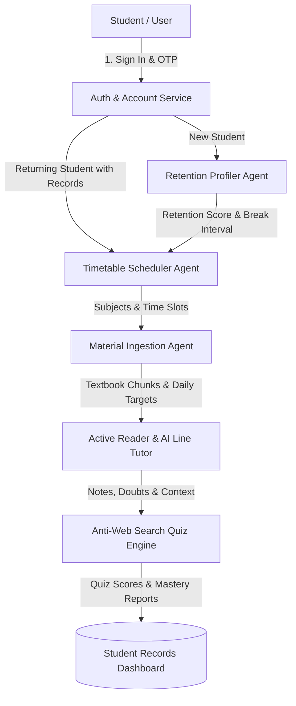

# 🧠 StudyPrep.AI — Autonomous Multi-Agent AI Study System
### *Scientific Focus Profiling &bull; Circadian Timetable Scheduling &bull; Smart PDF Ingestion (RAG) &bull; Anti-Google Active Recall*

<div align="center">


-success?style=for-the-badge&logo=pytest&logoColor=white)

---

### 🌐 Official Project Description
> **StudyPrep.AI** is an **Autonomous Multi-Agent AI Study System** built with **Scientific Focus & Retention Profiling**, **Personalized Circadian Timetable Scheduling**, **Smart Document Ingestion (RAG) with In-Line AI Tutoring**, and **Anti-Google Active Recall Quizzes**.

[Architecture](#-multi-agent-system-architecture) • [Core Modules](#-core-system-modules) • [How It Works](#-cognitive-science-foundations) • [API Endpoints](#-api-endpoints-overview) • [Quickstart Guide](#-quickstart-guide) • [Database Structure](#-database-structure)

</div>

---

## 🚀 Key Highlights

- 🧠 **Scientific Focus & Retention Profiler**: Measures your empirical attention span and working memory capacity with interactive neurocognitive tests instead of arbitrary self-reports.
- ⏰ **Circadian Timetable Scheduler**: Automatically constructs a balanced daily study schedule matched to your wake time, sleep time, cognitive peak hours, and break intervals.
- 🔄 **Smart Student Account Persistence**: Seamlessly recognizes returning students, saves active timetables, bookmarks, and quiz histories, allowing instant continuation or recalibration.
- 📖 **Distraction-Free PDF Reader**: Clean reader environment with margin annotations, quick bookmarks, and a real-time synchronized clock.
- 💡 **In-Line AI Line Tutor**: Highlight any sentence or paragraph to trigger instant contextual explanations in 4 specialized pedagogical modes (*Socratic, First Principles, ELI5, Exam Cram*).
- 🏆 **Anti-Web Search Active Recall Quizzes**: Generates passage-grounded active recall assessments testing conceptual depth that cannot be answered with a superficial search query.
- 📋 **Live Student Records Dashboard**: Dedicated multi-tab records console providing unified visibility into retention scores, active timetables, daily study targets, notes, and quiz performance.
- 🎬 **Cinematic Dark Theme**: Sleek, high-contrast user interface engineered for maximum visual comfort during extended study sessions.

---

## 🤖 Multi-Agent System Architecture

StudyPrep.AI connects specialized autonomous agents that pass structured state across your learning workflow:



| Agent / Service | Primary Responsibility | Technical Mechanism |
| :--- | :--- | :--- |
| **Auth & Account Service** | User registration, authentication & session state | Email/Phone OTP, Google OAuth, Supabase Cloud & SQLite fallbacks |
| **Retention Profiler Agent** | Cognitive endurance and focus span profiling | SART vigilance task, digit memory span, delayed recall, video focus |
| **Timetable Scheduler Agent** | Personalized circadian study schedule generation | Chronobiological energy models, rest intervals, live timer, `.ics` export |
| **Material Ingestion Agent** | Document parsing, text chunking & target pacing | PDF/EPUB extraction, vector RAG indexing, daily page capacity planner |
| **Active Reader & AI Line Tutor** | Distraction-free study with inline doubt resolution | Selection popover with 4 tutor personas (Socratic, First Principles, ELI5, Exam Cram) |
| **Anti-Web Search Quiz Engine** | Deep conceptual comprehension testing | Document-grounded query synthesis, distractor generation, instant scoring |

---

## 📚 Core System Modules

### 🔐 1. Authentication & Student Records Console
- **Flexible Sign-In**: Register and log in using Email, Phone Number, Password, or Google One-Click Login.
- **OTP Verification**: Secure 6-digit one-time password system with a 1-click `[⚡ Auto-Fill & Enter]` test shortcut for local development.
- **Records Dashboard**: A unified 5-tab analytics drawer displaying:
  - *Retention Score & Cognitive Tier*
  - *Active Timetable & Time Blocks*
  - *Saved Notes & Highlighted Bookmarks*
  - *Daily Subject Reading Targets*
  - *Historical Quiz Performance & Mastery Percentiles*
- **Recalibration & Reset**: Reset saved records at any time to recalibrate your retention profile without having to recreate your account.

### 🎯 2. Cognitive Attention & Retention Profiler
Evaluates your cognitive focus in under 3 minutes across 5 neurocognitive benchmarks:
1. **SART Vigilance Task**: Rapidly respond to random single digits while withholding responses for target number `3`.
2. **Digit Span Memory**: Retain and reproduce digit sequences of increasing length.
3. **Delayed Free Recall**: Measure short-term memory decay after an intermediate distractor task.
4. **Video Focus Test**: Evaluates susceptibility to visual and auditory distractions.
5. **Habits Survey**: Self-paced calibration of typical study duration and preferred pace.
- **Output**: Composite **Retention Score** (0–100%), designated **Focus Tier** (*Deep Focus Master*, *Standard Collegiate*, *Sprint Pacer*), and calculated optimal study block lengths (e.g., 45m study / 10m break).

### ⏰ 3. Circadian Timetable Scheduler
- **Active Timetable Detection**: When returning users sign in, the system offers 3 quick-action paths:
  - 🟢 **Keep Existing Timetable & Proceed to Study Materials**
  - 🔵 **View & Track Current Timetable**
  - 🟡 **Create / Calibrate New Timetable**
- **Circadian Pacing**: Prioritizes demanding subjects during morning peak alertness while scheduling strategic breaks around the post-lunch dip.
- **Integrated Focus Countdown**: Launch dedicated focus countdown timers directly from any timetable block with completion alerts.
- **Calendar Synchronization**: Export your optimized schedule directly as an `.ics` file for Google Calendar, Apple Calendar, and Outlook.

### 📚 4. Content Ingestion & Daily Target Planner
- Upload lecture notes, syllabus outlines, and textbook PDFs.
- Automatically calculates daily target page counts aligned with your specific focus stamina and exam deadlines.

### 📖 5. Distraction-Free Active Reader & AI Line Tutor
- High-contrast, clean document reader accompanied by a live laptop clock.
- **Contextual In-Line Tutor**: Highlight any phrase or complex paragraph to activate the tutor popover:
  - **Socratic Mode**: Guides you toward the answer through step-by-step questions.
  - **First Principles Mode**: Deconstructs concepts down to fundamental truths.
  - **ELI5 Mode**: Explains difficult ideas using simple, intuitive analogies.
  - **Exam Cram Mode**: Summarizes key formulas, definitions, and high-yield test points.
- **Margin Notes & Bookmarking**: Keep notes alongside textbook paragraphs and jump back to key sections instantly.

### 🏆 6. Anti-Web Search Quiz Engine
- Synthesizes conceptual questions rooted in the exact context of your uploaded materials.
- Formulates multi-step reasoning problems that cannot be solved by simply copy-pasting into a search engine.
- Instant feedback with detailed answer rationales and score tracking in the student records console.

---

## 🔬 Cognitive Science Foundations

StudyPrep.AI incorporates foundational methodologies from cognitive psychology and learning science:
- **Robertson et al. (1997)** — Sustained Attention to Response Task (SART) for measuring sustained attention lapses.
- **Baddeley (1986) & Miller (1956)** — Working memory capacity limits ($7 \pm 2$ items) and chunking dynamics.
- **Roediger & Karpicke (2006)** — The Testing Effect and active recall for robust memory consolidation.
- **Gazzaley & Rosen (2016)** — The Distracted Mind framework for managing digital attention and cognitive interruptions.
- **Kruger & Dunning (1999)** — Metacognitive calibration to prevent unrealistic study schedule overestimation.

---

## 🛠️ Tech Stack & Architecture

- **Backend**: Python 3.9+, FastAPI, SQLAlchemy 2.0, Pydantic v2, Uvicorn
- **Database**: PostgreSQL (Supabase Cloud) / SQLite (Local Zero-Config Fallback)
- **Frontend**: React 18, Vite, Lucide Icons, Modern CSS (Glassmorphism design system)
- **Testing**: Pytest (27 automated test cases, 100% passing)

```
AGENTIC AI PROJECT/
├── backend/
│   ├── agents/            # Multi-agent implementations (Retention, Scheduler, Reader, Quiz)
│   ├── api/               # FastAPI routers (auth, documents, reader, retention, scheduler, quiz)
│   ├── app/               # Application factory & FastAPI entrypoint
│   ├── db/                # SQLAlchemy database models & session management
│   ├── rag/               # Vector ingestion & retrieval pipeline
│   └── tests/             # Pytest test suite (27 passing tests)
├── frontend/
│   ├── src/
│   │   ├── components/    # Modular React components (Auth, Reader, Scheduler, Quiz, etc.)
│   │   ├── lib/           # Supabase client & API integration helpers
│   │   ├── App.jsx        # Main application state machine & coordinator
│   │   └── index.css      # Core design tokens & glassmorphic styling
│   └── package.json
├── .env.example           # Environment configuration template
└── README.md              # Project documentation
```

---

## 🔌 API Endpoints Overview

| Method | Endpoint | Description |
| :--- | :--- | :--- |
| `POST` | `/api/auth/register` | Register new user account with hashed credentials |
| `POST` | `/api/auth/login` | Authenticate user and issue session token |
| `POST` | `/api/auth/otp/send` | Generate and dispatch 6-digit OTP |
| `POST` | `/api/auth/otp/verify` | Verify OTP code and activate account |
| `GET` | `/api/auth/student-records` | Fetch unified student retention, timetable, and quiz records |
| `POST` | `/api/auth/clear-records` | Reset student study records for fresh calibration |
| `POST` | `/api/retention/calculate` | Compute retention score and optimal study intervals |
| `POST` | `/api/scheduler/generate` | Generate circadian-aligned timetable schedule |
| `POST` | `/api/documents/upload` | Ingest and chunk PDF/document study materials |
| `POST` | `/api/reader/ask-tutor` | Request line-by-line explanation from AI Line Tutor |
| `POST` | `/api/quiz/generate` | Generate anti-web search active recall quiz from reading material |

---

## ⚡ Quickstart Guide

### 1. Clone the Repository
```bash
git clone https://github.com/VikasHiremath14/study-prep-ai.git
cd study-prep-ai
```

### 2. Configure Environment Variables
```bash
cp .env.example .env
```

### 3. Backend Setup
```bash
# Navigate to backend directory
cd backend

# Create and activate virtual environment
python3 -m venv .venv
source .venv/bin/activate  # On Windows: .venv\Scripts\activate

# Install dependencies
pip install -r requirements.txt

# Start FastAPI backend server
python -m uvicorn backend.app.main:app --host 0.0.0.0 --port 8000 --reload
```
*Backend runs on `http://127.0.0.1:8000` with interactive Swagger API docs at `http://127.0.0.1:8000/docs`.*

### 4. Frontend Setup
```bash
# In a new terminal, navigate to frontend directory
cd frontend

# Install dependencies
npm install

# Start Vite development server
npm run dev
```
*Frontend runs on `http://localhost:8080`.*

### 5. Run Automated Tests
```bash
# From the project root folder:
backend/.venv/bin/pytest backend/tests -v
```

---

## 📊 Database Structure

```sql
-- Users (Authentication)
CREATE TABLE users (
    id SERIAL PRIMARY KEY,
    email VARCHAR(255) UNIQUE NOT NULL,
    phone_number VARCHAR(50),
    password_hash VARCHAR(255),
    supabase_uid VARCHAR(255) UNIQUE,
    auth_provider VARCHAR(50) DEFAULT 'email',
    is_email_verified BOOLEAN DEFAULT FALSE,
    created_at TIMESTAMP WITH TIME ZONE DEFAULT CURRENT_TIMESTAMP
);

-- Students (Profile & Sleep Times)
CREATE TABLE students (
    id SERIAL PRIMARY KEY,
    user_id INTEGER REFERENCES users(id) ON DELETE CASCADE,
    name VARCHAR(255) NOT NULL,
    phone_number VARCHAR(50),
    grade_level VARCHAR(50) DEFAULT 'engineering',
    wake_time VARCHAR(10) DEFAULT '06:30',
    sleep_time VARCHAR(10) DEFAULT '23:30'
);

-- Retention Profiles (Focus Test Results)
CREATE TABLE retention_profiles (
    id SERIAL PRIMARY KEY,
    student_id INTEGER UNIQUE REFERENCES students(id) ON DELETE CASCADE,
    retention_score FLOAT NOT NULL,
    break_interval_minutes INTEGER NOT NULL,
    details JSONB
);

-- Timetable Schedules (Circadian Study Slots)
CREATE TABLE schedules (
    id SERIAL PRIMARY KEY,
    student_id INTEGER REFERENCES students(id) ON DELETE CASCADE,
    wake_time VARCHAR(10) NOT NULL,
    total_study_hours FLOAT NOT NULL,
    slots JSONB NOT NULL
);
```

---

## 👥 Author

- **Vikas Hiremath** — *Lead Developer* ([GitHub Profile](https://github.com/VikasHiremath14))

---

<div align="center">
  <sub>Built to empower students with scientific focus profiling, smart circadian schedules, and deep active-recall understanding.</sub>
</div>
