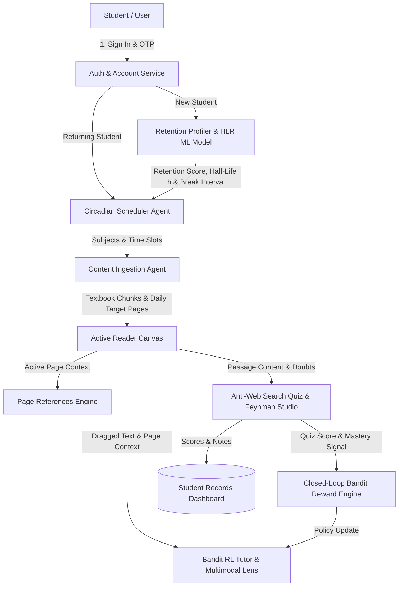

# 🧠 StudyPrep.AI — Autonomous Multi-Agent AI Study System
### *Scientific Focus Profiling • Half-Life Regression ML • Circadian Scheduling • Multi-Armed Bandit Tutor • Anti-Web Search Active Recall*

<div align="center">


-success?style=for-the-badge&logo=pytest&logoColor=white)

---

### 🌐 Official Project Overview
> **StudyPrep.AI** is an **Autonomous Multi-Agent AI Study System** engineered with **Empirical Neurocognitive Focus Profiling**, **Machine Learning Half-Life Regression (HLR) Forgetting Curves**, **Circadian Study Scheduling**, **Smart Document Ingestion (RAG)**, **Contextual Bandit Reinforcement Learning AI Tutoring**, and **Anti-Web Search Active Recall Mastery**.

[Architecture](#-multi-agent-system-architecture) • [Core Modules](#-core-system-modules) • [Machine Learning & RL](#-machine-learning--reinforcement-learning) • [API Endpoints](#-api-endpoints-overview) • [Quickstart Guide](#-quickstart-guide) • [Database Structure](#-database-structure)

</div>

---

## 🚀 Key Highlights

- 🧠 **Scientific Cognitive Profiler**: Measures empirical sustained attention (SART Go/No-Go), working memory capacity (Digit Span), delayed memory decay, and video distraction resistance in under 3 minutes.
- 📈 **Machine Learning Half-Life Regression (HLR)**: Parametric memory decay model trained via gradient descent to estimate personal memory half-life $h$ and synthesize exact probability-of-recall curves $p = 2^{-\Delta t / h}$.
- ⏰ **Circadian Timetable Scheduler**: Synthesizes biologically synchronized study blocks matched to your wake/sleep cycle, chronobiological energy peaks, and cognitive recovery intervals.
- 🔄 **Multi-Student Profile & Records Isolation**: Secure email/phone OTP and Google Authentication with distinct, per-student records management for notes, bookmarks, targets, and quiz histories.
- 📖 **Distraction-Free Active Reader**: Full-featured textbook reader with real-time local clock synchronization and timetable active-slot matching.
- 🤖 **Contextual Bandit Reinforcement Learning Tutor**: Multi-Armed Bandit (UCB1 exploration-exploitation) dynamically selects optimal tutor personas (*Auto Agent, ELI5, Deep Dive, Exam Crux*) based on student retention uplift.
- 🔍 **Multimodal Diagram Lens AI Scanner**: Multimodal vision scanner (Google Lens style) analyzing architectural diagrams, circuit schematics, formulas, and state machines.
- 🎥 **Curated Outside References Engine**: Page-by-page automatic curation of top YouTube video masterclasses and authoritative academic references.
- 🎙️ **Feynman Explainer Studio & Anti-Web Search Quizzes**: Speech-recognition powered voice studio evaluating open-ended mental models alongside passage-grounded scenario MCQs that cannot be looked up online.

---

## 🤖 Multi-Agent System Architecture

StudyPrep.AI is designed as an interconnected multi-agent pipeline with closed-loop reinforcement learning:



| Agent / Subsystem | Primary Responsibility | Technical Mechanism |
| :--- | :--- | :--- |
| **Auth & Account Service** | Student authentication, session state & user isolation | Email/Phone OTP, Google OAuth, Supabase Cloud & SQLite fallbacks |
| **Retention Profiler & HLR** | Empirical cognitive stamina & memory half-life modeling | SART vigilance task, digit memory span, half-life regression $(p = 2^{-\Delta t/h})$ |
| **Circadian Scheduler Agent** | Circadian study rhythm & break slot orchestration | Chronobiological energy models, focus countdown timers, `.ics` calendar sync |
| **Content Ingestion Agent** | Document parsing, text chunking & target planner | PDF/DOCX/TXT chunking, vector embeddings, daily page capacity allocator |
| **Bandit RL QA Tutor** | Grounded line-level tutoring calibrated to student state | Upper Confidence Bound (UCB1) multi-armed bandit, RAG context retrieval |
| **Multimodal Diagram Lens** | Visual diagram, circuit, and formula analysis | Vision LLM analysis, step-by-step state transition breakdown |
| **Page References Engine** | Tailored video lectures & academic web links | Page NLP taxonomy matcher, YouTube search generator, Wikipedia/GeeksforGeeks links |
| **Anti-Web Search Quiz Engine** | Non-searchable active recall scenario challenges | Invariant challenge synthesis, Feynman voice explainer studio, closed-loop RL feedback |

---

## 🧠 Machine Learning & Reinforcement Learning

### 1. Half-Life Regression (HLR) Cognitive Model
Implements Duolingo's parametric half-life decay formulation:
$$p = 2^{-\frac{\Delta t}{h}}, \quad h = 2^{\mathbf{\Theta} \cdot \mathbf{x}}$$
- **Input Features $\mathbf{x}$**: Empirical SART vigilance, working memory digit span, delayed recall accuracy, distractions penalty, and study pace stamina.
- **Gradient Optimization**: Custom NumPy gradient descent minimizing log-loss with $L_2$ regularization:
  $$\mathcal{L} = \sum (p - y)^2 + \lambda \|\mathbf{\Theta}\|^2$$
- **Synthesis**: Generates real-time 14-day retention probability decay curves tailored to student cognitive endurance.

### 2. Contextual Multi-Armed Bandit RL Tutor Policy
- **Action Space**: 4 pedagogical personas:
  - ⚡ `Auto Agent`: Adaptive multi-objective synthesis
  - 💡 `ELI5 Mode`: Concrete real-world intuitive analogies
  - 📖 `Deep Dive Mode`: Rigorous mathematical mechanics & structural invariants
  - ⚡ `Exam Crux Mode`: High-yield test traps & 3-bullet revision anchors
- **Exploration Policy (UCB1)**:
  $$\text{Score}(a) = \bar{R}_a + c \sqrt{\frac{\ln N}{N_a}}$$
- **Closed-Loop Reward**: Directly fed back when students complete active recall quizzes:
  $$\text{Reward} = \Delta \text{Score} = \text{Score}_{\text{post}} - \text{Score}_{\text{pre}}$$

---

## 📚 Core System Modules

### 🔐 1. Authentication & Student Records Console
- **Multi-Factor Access**: Email, Phone OTP, Password, and Google One-Click Login.
- **Per-Student Isolation**: Complete partition of notes, bookmarks, daily targets, and quiz attempts per student account.
- **Records Drawer**: Dedicated 5-tab analytics console displaying:
  - *Retention Score, Focus Tier & Memory Half-Life*
  - *Active Timetable & Time Blocks*
  - *Saved Margin Notes & Bookmarks*
  - *Active Daily Subject Reading Targets*
  - *Historical Quiz Performance & Mastery Tiers*

### 🎯 2. Cognitive Attention & Retention Profiler
Evaluates cognitive focus in under 3 minutes across 5 neurocognitive benchmarks:
1. **SART Vigilance Task**: Rapidly respond to single digits while withholding response for target `3`.
2. **Digit Span Memory**: Retain and reproduce digit sequences of increasing length.
3. **Delayed Free Recall**: Measure memory decay after intermediate distractor tasks.
4. **Video Focus Test**: Evaluates susceptibility to visual and auditory distractions.
5. **Habits Survey**: Self-paced calibration of typical study duration and preferred pace.

### ⏰ 3. Circadian Timetable Scheduler
- **Chronobiological Energy Mapping**: Synchronizes demanding study sessions to peak circadian alertness.
- **Live Local Clock & Timetable Slot Sync**: Top header tracks real-time laptop clock and highlights the current active study block.
- **Focus Countdown Timers**: Launch dedicated countdown timers directly from any timetable slot.
- **Calendar Export**: Export optimized study schedules directly to `.ics` for Google Calendar, Apple Calendar, and Outlook.

### 📖 4. Active Reader, Line-Level AI Tutor & References
- **Line-Level Selection Popover**: Highlight any text snippet to trigger instant grounded explanations.
- **Page References Drawer**: Automatically discovers curated YouTube video lectures and reference sites for each active page.
- **Diagram Lens Scanner**: Multimodal AI breakdown of uploaded charts, architecture diagrams, and formulas.

### 🏆 5. Anti-Web Search Recall Quizzes & Feynman Studio
- **Scenario-Based Invariant Quizzes**: Generates conceptual scenario questions that test true understanding over rote memorization.
- **Feynman Technique Explainer Studio**: Built-in speech-to-text dictation allows students to explain concepts in simple terms with automated mental model critique.

---

## 🛠️ Tech Stack & Architecture

- **Backend**: Python 3.9+, FastAPI, SQLAlchemy 2.0, NumPy, Pydantic v2, Uvicorn, Pytest
- **Database**: PostgreSQL (Supabase Cloud) / SQLite (Local Zero-Config Fallback)
- **Frontend**: React 18, Vite, Lucide Icons, Vanilla CSS Design System
- **Testing**: Pytest (35 automated unit/integration tests, 100% passing)

```
AGENTIC AI PROJECT/
├── backend/
│   ├── agents/            # Multi-agent implementations (Bandit RL, Retention, Scheduler, Reader, Quiz)
│   ├── api/               # FastAPI route handlers (auth, documents, reader, retention, scheduler, quiz)
│   ├── app/               # Application factory & FastAPI entrypoint
│   ├── db/                # SQLAlchemy database models & session management
│   ├── ml/                # Machine Learning models (Half-Life Regression)
│   ├── rag/               # Vector ingestion & retrieval pipeline
│   └── tests/             # Pytest test suite (35 passing tests)
├── frontend/
│   ├── src/
│   │   ├── components/    # Modular React components organized by Phase 0 through 6
│   │   ├── lib/           # Supabase client & API integration helpers
│   │   ├── App.jsx        # Main state coordinator
│   │   └── index.css      # Design tokens & glassmorphic styles
│   └── package.json
├── .github/workflows/     # GitHub Actions CI pipeline
├── .env.example           # Environment configuration template
└── README.md              # Project documentation
```

---

## 🔌 API Endpoints Overview

| Method | Endpoint | Description |
| :--- | :--- | :--- |
| `POST` | `/api/auth/signup` | Register student account with email/phone |
| `POST` | `/api/auth/signin` | Authenticate student and load user session |
| `POST` | `/api/auth/send-otp` | Dispatch 6-digit OTP via Email or SMS |
| `POST` | `/api/auth/google-auth` | Authenticate via Google OAuth token |
| `GET` | `/api/auth/student/{id}/records` | Fetch unified student retention, timetable, notes & quiz records |
| `POST` | `/api/retention/evaluate-profile` | Evaluate neurocognitive test battery & compute retention score |
| `GET` | `/api/retention/forgetting-curve/{id}` | Synthesize ML Half-Life Regression retention decay curve |
| `POST` | `/api/scheduler/calibrate` | Generate circadian-aligned study timetable |
| `POST` | `/api/documents/upload-file` | Ingest and chunk PDF/DOCX study materials |
| `POST` | `/api/reader/agentic-explain` | RL Contextual Bandit adaptive line-level tutor explanation |
| `POST` | `/api/reader/explain` | Mode-calibrated line-level explanation (ELI5, Deep Dive, Exam Crux) |
| `POST` | `/api/reader/references` | Curate YouTube video lessons & academic sites for active page |
| `POST` | `/api/reader/lens-explain` | Multimodal AI diagram and formula scanner |
| `GET` | `/api/reader/bandit-stats` | Fetch Contextual Bandit RL analytics & persona win rates |
| `POST` | `/api/quiz/generate` | Generate anti-web search active recall scenario quiz |
| `POST` | `/api/quiz/submit` | Evaluate quiz submission and update bandit RL reward signal |
| `POST` | `/api/quiz/feynman-evaluate` | Evaluate student's open-ended Feynman explanation |

---

## ⚡ Quickstart Guide

### 1. Clone the Repository
```bash
git clone https://github.com/VikasHiremath14/study-prep-ai.git
cd study-prep-ai
```

### 2. Configure Environment Variables
```bash
cp .env.example .env
```

### 3. Backend Setup
```bash
# Navigate to backend directory
cd backend

# Create and activate virtual environment
python3 -m venv .venv
source .venv/bin/activate  # On Windows: .venv\Scripts\activate

# Install dependencies
pip install -r requirements.txt

# Start FastAPI backend server
python -m uvicorn backend.app.main:app --host 127.0.0.1 --port 8000 --reload
```
*Backend runs on `http://127.0.0.1:8000` with interactive Swagger API docs at `http://127.0.0.1:8000/docs`.*

### 4. Frontend Setup
```bash
# In a new terminal, navigate to frontend directory
cd frontend

# Install dependencies
npm install

# Start Vite development server
npm run dev
```
*Frontend runs on `http://localhost:8080`.*

### 5. Run Automated Tests
```bash
# From repository root folder:
PYTHONPATH=. backend/.venv/bin/pytest backend/tests/ -v
```

---

## 📊 Database Structure

```sql
-- Users (Authentication)
CREATE TABLE users (
    id SERIAL PRIMARY KEY,
    email VARCHAR(255) UNIQUE NOT NULL,
    phone_number VARCHAR(50),
    password_hash VARCHAR(255),
    supabase_uid VARCHAR(255) UNIQUE,
    auth_provider VARCHAR(50) DEFAULT 'email',
    is_email_verified BOOLEAN DEFAULT FALSE,
    created_at TIMESTAMP WITH TIME ZONE DEFAULT CURRENT_TIMESTAMP
);

-- Students (Profile & Sleep Times)
CREATE TABLE students (
    id SERIAL PRIMARY KEY,
    user_id INTEGER REFERENCES users(id) ON DELETE CASCADE,
    name VARCHAR(255) NOT NULL,
    phone_number VARCHAR(50),
    grade_level VARCHAR(50) DEFAULT 'engineering',
    wake_time VARCHAR(10) DEFAULT '06:30',
    sleep_time VARCHAR(10) DEFAULT '23:30'
);

-- Retention Profiles (Focus Test Results & HLR Half-Life)
CREATE TABLE retention_profiles (
    id SERIAL PRIMARY KEY,
    student_id INTEGER UNIQUE REFERENCES students(id) ON DELETE CASCADE,
    retention_score FLOAT NOT NULL,
    break_interval_minutes INTEGER NOT NULL,
    details JSONB
);

-- Timetable Schedules (Circadian Study Slots)
CREATE TABLE schedules (
    id SERIAL PRIMARY KEY,
    student_id INTEGER REFERENCES students(id) ON DELETE CASCADE,
    wake_time VARCHAR(10) NOT NULL,
    total_study_hours FLOAT NOT NULL,
    slots JSONB NOT NULL
);

-- Documents & Daily Targets
CREATE TABLE documents (
    id SERIAL PRIMARY KEY,
    title VARCHAR(255) NOT NULL,
    total_pages INTEGER NOT NULL,
    created_at TIMESTAMP WITH TIME ZONE DEFAULT CURRENT_TIMESTAMP
);

CREATE TABLE daily_targets (
    id SERIAL PRIMARY KEY,
    student_id INTEGER REFERENCES students(id) ON DELETE CASCADE,
    document_id INTEGER REFERENCES documents(id) ON DELETE CASCADE,
    day_number INTEGER NOT NULL,
    start_page INTEGER NOT NULL,
    end_page INTEGER NOT NULL,
    is_completed BOOLEAN DEFAULT FALSE
);

-- Notes, Bookmarks & Doubts
CREATE TABLE notes (
    id SERIAL PRIMARY KEY,
    student_id INTEGER REFERENCES students(id) ON DELETE CASCADE,
    document_id INTEGER REFERENCES documents(id) ON DELETE CASCADE,
    page_number INTEGER NOT NULL,
    selected_text TEXT,
    note_text TEXT,
    is_bookmark BOOLEAN DEFAULT FALSE,
    created_at TIMESTAMP WITH TIME ZONE DEFAULT CURRENT_TIMESTAMP
);

-- Quiz Attempts & Bandit Feedback
CREATE TABLE quiz_attempts (
    id SERIAL PRIMARY KEY,
    quiz_id INTEGER,
    student_id INTEGER REFERENCES students(id) ON DELETE CASCADE,
    score FLOAT NOT NULL,
    total_questions INTEGER NOT NULL,
    student_answers JSONB NOT NULL,
    created_at TIMESTAMP WITH TIME ZONE DEFAULT CURRENT_TIMESTAMP
);
```

---

## 👥 Author

- **Vikas Hiremath** — *Lead Developer* ([GitHub Profile](https://github.com/VikasHiremath14))

---

<div align="center">
  <sub>StudyPrep.AI — Empowering students with empirical neurocognitive profiling, ML retention decay curves, circadian schedules, and active recall comprehension.</sub>
</div>
