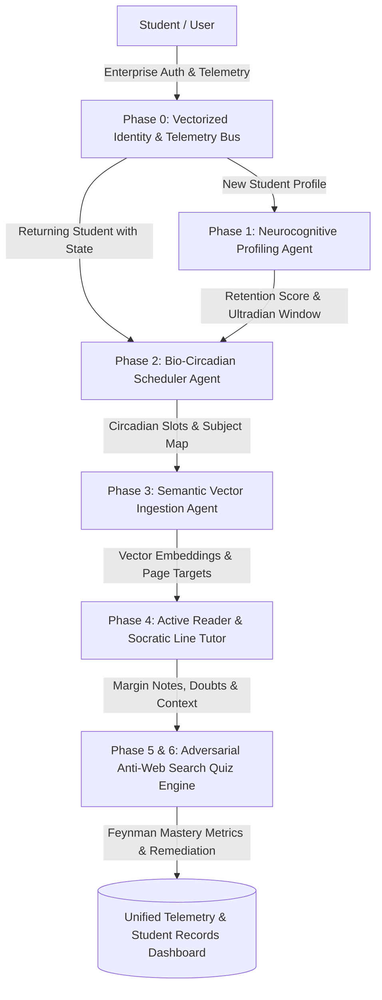

# 🧠 StudyPrep.AI — Autonomous Multi-Agent Cognitive Study Operating System
### *Enterprise-Grade Agentic AI &bull; Neurocognitive Attention Profiling &bull; Bio-Circadian Pacing &bull; Semantic Vector RAG &bull; Adversarial Active Recall*

<div align="center">


-success?style=for-the-badge&logo=pytest&logoColor=white)

---

### 🌐 Official GitHub Project Description
> **StudyPrep.AI** is an advanced **Agentic AI study operating system** that synthesizes **neurocognitive behavioral profiling**, **bio-circadian chronotype pacing**, **semantic vector RAG document ingestion**, and **adversarial anti-web search active recall**. Powered by a deterministic multi-agent orchestration architecture, it measures empirical student focus endurance, corrects cognitive burnout schedules, provides line-level multi-persona tutoring, and verifies true conceptual mastery.

[Executive Overview](#-executive-overview) • [Agentic AI Architecture](#-agentic-ai-multi-agent-system-architecture) • [AI/ML & Cognitive Foundations](#-neurocognitive-scientific--aiml-foundations) • [Six Core Phases](#-the-six-integrated-phases) • [Quickstart Guide](#-quickstart-guide) • [Database Architecture](#-database-schema)

</div>

---

## 🏛️ Executive Overview

Traditional academic preparation relies on static timetables and brute-force memorization that neglect human neurobiology, working memory constraints, and media-induced attention fragmentation. 

**StudyPrep.AI** introduces an end-to-end **Autonomous Cognitive Engineering Platform** that treats learning as a calibrated neuro-computational feedback loop:
1. **Agentic Neurocognitive Diagnostics (Phase 1)**: Measures empirical sustained attention endurance, working memory span, and dopamine decay curves to compute a mathematical composite retention score.
2. **Bio-Circadian Chronobiology Engine (Phase 2)**: Translates retention metrics into non-uniform study schedules, enforcing prefrontal cortisol peak alignment, ultradian focus blocks, and postprandial downtime buffers.
3. **Semantic Vector Ingestion & Chunking (Phase 3)**: Dynamically indexes complex syllabi, textbooks, and lecture notes into vector embeddings with retention-calibrated daily page milestones.
4. **Multi-Persona Pedagogical Intelligence (Phase 4)**: Embedded distraction-free active reader with real-time synchronized telemetry and in-line contextual tutors (Socratic, First Principles, ELI5, Exam-Cram).
5. **Adversarial Anti-Web Search Active Recall (Phases 5 & 6)**: Generates passage-specific, hallucination-resistant evaluation matrices that cannot be solved via search engines, driving deep Feynman conceptual mastery.
6. **Unified State & Identity Telemetry (Phase 0)**: Supabase-vectorized identity with dual-channel OTP verification and a 5-tab real-time telemetry dashboard.


---

## 🤖 Agentic AI Multi-Agent System Architecture



| Phase & Agent | Responsibility | Core Mechanism & Research Foundation |
| :--- | :--- | :--- |
| **Phase 0: Vectorized Identity Fabric** | Authentication, OTP Dispatch, Real-Time Telemetry Sync | Supabase Auth + Local SHA-256 fallback, 6-digit Multi-Channel OTP, Google One-Click OAuth, 5-Tab Consolidated Records Bus |
| **Phase 1: Neurocognitive Profiling Agent** | Measures empirical attention endurance & focus curves | Multi-signal neuropsychological battery: SART Vigilance, Digit Span Buffer, Delayed Recall Decay, Video Dopamine Tolerance, Metacognitive Calibration |
| **Phase 2: Bio-Circadian Pacing Agent** | Synthesizes realistic, non-uniform study pacing | Circadian biology rules engine, Post-Wake Cortisol Buffers, Ultradian rhythm pacer, Postprandial dip downtime, Live Audio Focus Tracker, RFC 5545 .ics export |
| **Phase 3: Semantic Ingestion Agent** | High-dimensional document vectorization & chunking | Document text chunking, vector embedding generation, and retention-calibrated daily page milestone planning |
| **Phase 4: Contextual Line Tutor Agent** | Distraction-free active reading & line-level tutoring | Page-scoped similarity retrieval, in-line text margin notes & bookmarks, 4 pedagogical persona pipelines (Socratic, First Principles, ELI5, Exam Cram) |
| **Phase 5 & 6: Adversarial Recall Agent** | Active recall & Feynman mastery synthesis | Passage-specific question synthesis weighting student annotated sections, instant misconception remediation, historical mastery scoring |

---

## 🧪 Neurocognitive Scientific & AI/ML Foundations

The system's core algorithmic scoring engines are grounded in peer-reviewed cognitive science, computational neuroscience, and AI/ML literature:

1. **Executive Inhibitory Control & SART Vigilance** (*Robertson et al., 1997*):
   - Theoretical Framework: Prefrontal executive control and sustained vigilance.
   - Algorithmic Metric: Penalizes commission errors on No-Go target `3` and omission lapses to model real-time distractibility.
2. **Working Memory Capacity & Central Executive Buffer** (*Baddeley 1986; Miller 1956*):
   - Theoretical Framework: Multi-component working memory buffer model ($7 \pm 2$).
   - Algorithmic Metric: Dynamically scales forward digit sequences to establish maximum analytical throughput capacity.
3. **Hippocampal Memory Decay Curves & Testing Effect** (*Roediger & Karpicke, 2006; Ebbinghaus 1885*):
   - Theoretical Framework: Unprompted retrieval practice after working memory flush.
   - Algorithmic Metric: Quantifies free recall retention without contextual cues to measure synaptic consolidation.
4. **Bottom-Up Dopamine Foraging & Media Multitasking** (*Gazzaley & Rosen, 2016 MIT Press*):
   - Theoretical Framework: Prefrontal vulnerability to low-friction micro-rewards.
   - Algorithmic Metric: Measures video skip latency and completion thresholds to calibrate ultradian break frequency.
5. **Metacognitive Calibration & Dunning-Kruger Discount** (*Kruger & Dunning, 1999*):
   - Theoretical Framework: Discrepancy between perceived vs empirical cognitive endurance.
   - Algorithmic Metric: Calculates the Metacognitive Optimism Gap to discount overconfident self-reported study habits.

---

## 🚀 The Six Integrated Phases

### 🔐 Phase 0: Vectorized Identity Fabric & Consolidated Telemetry
- **Multi-Channel Authentication**: Email, Mobile, Password with confirmation validation.
- **Resilient OTP Dispatch**: 6-digit OTP delivery simulation with 1-click `[⚡ Auto-Fill & Enter]` in developer mode.
- **Google One-Click OAuth**: Seamless Google account synchronization with linked student profiles.
- **Consolidated Student Records Telemetry**: Interactive 5-tab dashboard modal (*Retention Report, Active Timetable, Notes & Bookmarks, Daily Targets, Quiz Analytics*) with a non-destructive `"Clear All Study Records"` feature that preserves user account credentials.

### 🎯 Phase 1: Neurocognitive Retention Profiler Engine
- 5-step empirical neurocognitive diagnostic battery:
  1. **SART Vigilance Matrix**: High-frequency numerical stream measuring inhibitory slips.
  2. **Digit Span Memory Capacity**: Dynamic forward-span sequence scaling.
  3. **Delayed Free Recall**: Unprompted retrieval test post-distractor buffer flush.
  4. **Short-Form Dopamine Test**: Real-time evaluation of short-form video watch completion and skip reflexes.
  5. **Baseline Habit Survey**: Self-reported session lengths and multi-stage series perseverance.
- **Output**: Composite Retention Score (0.00–1.00), Focus Tier (*Deep Focus Master*, *Standard Collegiate*, *Sprint Pacer*, *Micro-Focus Recovery*), and optimal study/break duration formula.

### ⏰ Phase 2: Bio-Circadian Chronobiology & Timetable Corrector
- **Active Schedule Detection & 3-Choice Prompt**: Automatically detects existing schedules and presents:
  - 🟢 **Keep Existing Timetable & Proceed to Materials (Phase 3)**
  - 🔵 **View & Track Current Timetable**
  - 🟡 **Recalibrate / Create New Timetable**
- **Circadian Rhythmic Pacing**: Allocates non-uniform study blocks matching student chronotype, morning prefrontal alertness windows, and meal downtime buffers.
- **Live Focus Tracker**: Interactive countdown timer with Web Audio API psychoacoustic chime notifications.
- **Delusion Scanner**: Audits overambitious cramming schedules and generates scientifically balanced corrections.
- **Calendar Export**: Standard RFC 5545 `.ics` export for Google Calendar, Apple Calendar, and Outlook.

### 📚 Phase 3: Semantic Vector Document Ingestion
- Ingests PDFs, lecture slides, and course syllabi.
- Semantic vector chunking with target daily page breakdown calibrated to student retention scores.

### 📖 Phase 4: Distraction-Free Active Reader & Line-Level Socratic Tutor
- Clean, focused document viewer with real-time synchronized laptop clock.
- **Line-Level Multi-Persona Tutor**: Highlight any text passage to trigger instant explanations across 4 pedagogical modes:
  - **Socratic Guide**: Asks probing questions to guide discovery.
  - **First Principles**: Derives concepts from fundamental axioms.
  - **ELI5**: Breaks down complex topics using intuitive analogies.
  - **Exam Cram**: Focuses strictly on high-yield exam takeaways.
- **Margin Notes & Bookmarks**: Save custom notes and bookmarks synced directly to DB and local storage.

### 🏆 Phase 5 & 6: Adversarial Anti-Web Search Quiz & Feynman Mastery
- Generates passage-specific quizzes that cannot be answered via generic search engines.
- Assesses conceptual understanding, provides immediate remediation, and logs attempts in the student dashboard.


---

## 🛠️ Tech Stack

- **Backend**: Python 3.9+, FastAPI, SQLAlchemy 2.0 (ORM), Pydantic v2, Uvicorn
- **Database**: SQLite (local development) / PostgreSQL with Supabase (cloud production)
- **Frontend**: React 18, Vite, Lucide Icons, Vanilla CSS Design System
- **Testing**: Pytest, AsyncIO, Coverage

---

## ⚡ Quickstart Guide

### 1. Clone the Repository
```bash
git clone https://github.com/VikasHiremath14/study-prep-ai.git
cd study-prep-ai
```

### 2. Backend Setup
```bash
# Navigate to backend directory
cd backend

# Create and activate virtual environment
python3 -m venv .venv
source .venv/bin/activate  # On Windows: .venv\Scripts\activate

# Install dependencies
pip install -r requirements.txt

# Start FastAPI server
python -m uvicorn backend.app.main:app --host 0.0.0.0 --port 8000 --reload
```
*The FastAPI backend will run on `http://127.0.0.1:8000` with interactive Swagger docs at `http://127.0.0.1:8000/docs`.*

### 3. Frontend Setup
```bash
# In a new terminal, navigate to frontend directory
cd frontend

# Install dependencies
npm install

# Start Vite development server
npm run dev
```
*The frontend interface will run on `http://localhost:8080` (or `http://localhost:5173`).*

### 4. Running Backend Tests
```bash
# Run pytest test suite from workspace root
backend/.venv/bin/pytest backend/tests -v
```

---

## 📊 Database Schema

```sql
-- Core User Authentication
CREATE TABLE users (
    id SERIAL PRIMARY KEY,
    email VARCHAR(255) UNIQUE NOT NULL,
    phone_number VARCHAR(50),
    password_hash VARCHAR(255),
    supabase_uid VARCHAR(255) UNIQUE,
    auth_provider VARCHAR(50) DEFAULT 'email',
    is_email_verified BOOLEAN DEFAULT FALSE,
    is_phone_verified BOOLEAN DEFAULT FALSE,
    created_at TIMESTAMP WITH TIME ZONE DEFAULT CURRENT_TIMESTAMP,
    last_login_at TIMESTAMP WITH TIME ZONE DEFAULT CURRENT_TIMESTAMP
);

-- Student Academic & Circadian Profile
CREATE TABLE students (
    id SERIAL PRIMARY KEY,
    user_id INTEGER REFERENCES users(id) ON DELETE CASCADE,
    name VARCHAR(255) NOT NULL,
    phone_number VARCHAR(50),
    grade_level VARCHAR(50) DEFAULT 'engineering',
    wake_time VARCHAR(10) DEFAULT '06:30',
    sleep_time VARCHAR(10) DEFAULT '23:30',
    created_at TIMESTAMP WITH TIME ZONE DEFAULT CURRENT_TIMESTAMP
);

-- Neurocognitive Retention Profiles (Phase 1)
CREATE TABLE retention_profiles (
    id SERIAL PRIMARY KEY,
    student_id INTEGER UNIQUE REFERENCES students(id) ON DELETE CASCADE,
    retention_score FLOAT NOT NULL,
    break_interval_minutes INTEGER NOT NULL,
    series_completion_score FLOAT,
    reel_watch_score FLOAT,
    sustained_focus_score FLOAT,
    self_report_score FLOAT,
    distraction_recovery_score FLOAT,
    details JSONB,
    created_at TIMESTAMP WITH TIME ZONE DEFAULT CURRENT_TIMESTAMP
);

-- Circadian Timetable Schedules (Phase 2)
CREATE TABLE schedules (
    id SERIAL PRIMARY KEY,
    student_id INTEGER REFERENCES students(id) ON DELETE CASCADE,
    wake_time VARCHAR(10) NOT NULL,
    total_study_hours FLOAT NOT NULL,
    slots JSONB NOT NULL,
    corrections_made JSONB,
    created_at TIMESTAMP WITH TIME ZONE DEFAULT CURRENT_TIMESTAMP
);
```

---

## 👥 Authors & Contributors

- **Vikas Sharma / Vikas Hiremath** — *Lead Architect & Developer* ([GitHub](https://github.com/VikasHiremath14))

---

<div align="center">
  <sub>Built with 🧠 and cognitive science principles for next-generation academic excellence.</sub>
</div>

