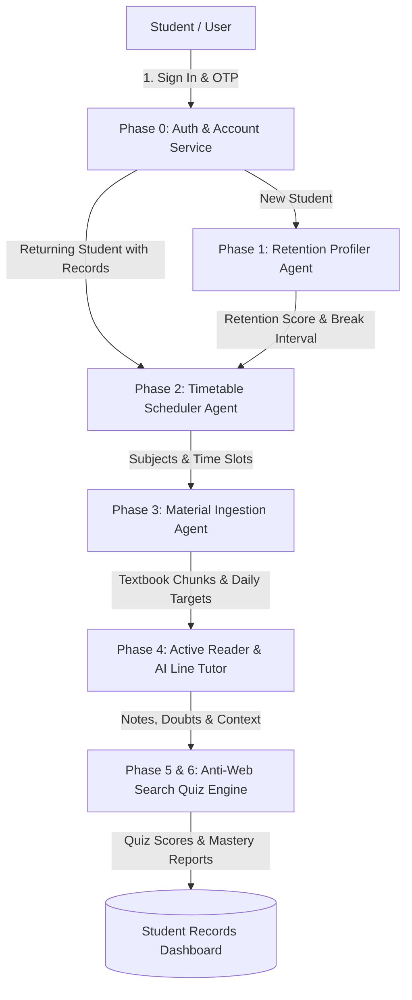

# 🧠 StudyPrep.AI — Autonomous Multi-Agent AI Study System
### *Scientific Focus Profiling &bull; Circadian Timetable Scheduling &bull; Smart PDF Ingestion (RAG) &bull; Anti-Google Active Recall*

<div align="center">


-success?style=for-the-badge&logo=pytest&logoColor=white)

---

### 🌐 Official Project Description
> **StudyPrep.AI** is an **Autonomous Multi-Agent AI Study System** built with **Scientific Focus & Retention Profiling**, **Personalized Circadian Timetable Scheduling**, **Smart Document Ingestion (RAG) with In-Line AI Tutoring**, and **Anti-Google Active Recall Quizzes**.

[Architecture](#-multi-agent-system-architecture) • [Core Features (6 Phases)](#-the-six-phases-of-studyprepai) • [How It Works](#-how-the-ai-works) • [Quickstart Guide](#-quickstart-guide) • [Database Structure](#-database-structure)

</div>


---

## 🚀 Key Highlights

- 🧠 **Focus & Retention Test**: Measures your actual attention span and memory endurance with quick neurocognitive tests instead of guessing.
- ⏰ **Smart Circadian Timetable**: Automatically builds a realistic daily timetable matching your wake time, sleep time, and focus stamina.
- 🔄 **Smart Account Persistence**: Recognizes returning users instantly, saves all study records, and lets you reuse or recalibrate your timetable anytime.
- 📖 **Distraction-Free PDF Reader**: Read textbooks and notes in a clean interface with a real-time synchronized clock.
- 💡 **Instant Line-by-Line AI Tutor**: Highlight any sentence or paragraph to get instant explanations in 4 tutor styles (Socratic, First Principles, Simple ELI5, Exam Cram).
- 🏆 **Anti-Web Search Quizzes**: Generates passage-specific quizzes that test deep understanding rather than simple memorization (answers cannot be easily googled).
- 📋 **Student Records Dashboard**: Live dashboard showing your retention score, active timetable, saved notes, bookmarks, daily targets, and quiz attempts.
- 🎬 **Atmospheric Cinematic Dark Theme**: Sleek dark-mode interface with high-tech science aesthetics and smooth transitions.

---

## 🤖 Multi-Agent System Architecture

StudyPrep.AI connects specialized AI agents that pass data seamlessly across your study workflow:



| Phase & Agent | What It Does | How It Works |
| :--- | :--- | :--- |
| **Phase 0: Auth & Records** | Handles login, OTP verification, and study history | Email & Mobile OTP, Google Login, Supabase / local SQLite database, and consolidated records modal |
| **Phase 1: Retention Profiler** | Measures your focus span & optimal break intervals | 5 quick tests: SART attention vigilance, digit memory span, delayed recall, and video focus |
| **Phase 2: Timetable Scheduler** | Builds a personalized, realistic study schedule | Circadian rhythm rules, meal/rest breaks, live countdown focus timer, and `.ics` calendar export |
| **Phase 3: Material Ingestion** | Uploads course PDFs and creates daily page targets | Chunks textbook content and calculates how many pages to read daily based on your focus score |
| **Phase 4: Active Reader & Tutor** | Distraction-free reading with instant doubt solver | Highlight text to ask doubts in 4 modes: Socratic, First Principles, ELI5 (Simple), Exam Cram |
| **Phase 5 & 6: Anti-Web Search Quiz** | Tests real conceptual understanding | Generates questions directly from your reading material that cannot be found with a simple web search |

---

## 📚 The Six Phases of StudyPrep.AI

### 🔐 Phase 0: Accounts & Student Records
- **Fast Sign Up & Login**: Register with Name, Email, Phone number, and Password.
- **OTP Verification**: 6-digit OTP sent via email/mobile with a convenient 1-click `[⚡ Auto-Fill & Enter]` button for fast local testing.
- **Google One-Click Login**: Quick login option for instant access.
- **Records Dashboard**: A dedicated popup dashboard with 5 tabs (*Retention Score, Active Timetable, Notes & Bookmarks, Daily Targets, Quiz History*).
- **Clear Records Option**: Easily reset your study records to take a fresh retention test while keeping your account signed in.

### 🎯 Phase 1: Attention & Retention Profiler
Takes less than 3 minutes to test your cognitive stamina:
1. **SART Vigilance Test**: Tap numbers as they flash, but hold back when the number `3` appears.
2. **Digit Span Memory**: Remember and repeat forward number sequences.
3. **Delayed Free Recall**: Test what words you remember after a quick distractor task.
4. **Video Focus Test**: Evaluates how easily you get distracted by short video clips.
5. **Study Habits Survey**: Quick survey on your typical study duration.
- **Result**: You receive an accurate composite **Retention Score** (e.g., 78%), a **Focus Tier** (*Deep Focus Master*, *Standard Collegiate*, *Sprint Pacer*), and your optimal study block duration (e.g., *45 mins study / 10 mins break*).

### ⏰ Phase 2: Circadian Timetable & Scheduler
- **Active Timetable Detection**: If you already have a saved timetable, the AI greets you with 3 options:
  - 🟢 **Keep Existing Timetable & Proceed to Study Materials (Phase 3)**
  - 🔵 **View & Track Current Timetable**
  - 🟡 **Create / Calibrate New Timetable**
- **Circadian Pacing**: Places hard subjects during your peak morning energy window and schedules meal/rest breaks to avoid afternoon slumps.
- **Live Focus Timer**: Click "Focus" on any study slot to start an interactive countdown timer with completion chimes.
- **Calendar Export**: Download your schedule as a standard `.ics` file to import into Google Calendar or Apple Calendar.

### 📚 Phase 3: Content Ingestion & Daily Target Planner
- Upload PDFs, lecture slides, and notes for your subjects.
- The AI divides your textbooks into daily reading targets based on your retention score.

### 📖 Phase 4: Distraction-Free Active Reader & AI Line Tutor
- Read your study material in a clean, high-contrast viewer with a real-time laptop clock.
- **Line-Level AI Tutor**: Highlight any sentence to open an AI popover with 4 explanation styles:
  - **Socratic**: Asks guiding questions to help you think through the answer.
  - **First Principles**: Explains the concept starting from fundamental building blocks.
  - **ELI5 (Explain Like I'm 5)**: Uses simple real-world analogies.
  - **Exam Cram**: Gives high-yield key points and exam definitions.
- **Margin Notes & Bookmarks**: Add inline notes and bookmark important pages for quick review.

### 🏆 Phase 5 & 6: Anti-Web Search Quizzes & Mastery
- Creates custom active-recall quizzes directly from the pages you just read.
- Questions test deep conceptual logic rather than surface-level definitions, making them impossible to cheat with quick web searches.
- Shows instant explanations for mistakes and tracks your improvement over time.

---

## 🔬 How the AI Works

StudyPrep.AI uses proven research from cognitive psychology and AI systems:
- **Robertson et al. (1997)** — Sustained Attention to Response Task (SART) for measuring focus slips.
- **Baddeley (1986) & Miller (1956)** — Working memory capacity limits ($7 \pm 2$ items).
- **Roediger & Karpicke (2006)** — The testing effect and delayed recall for long-term memory retention.
- **Gazzaley & Rosen (2016)** — The Distracted Mind research on managing digital distractions and dopamine loops.
- **Kruger & Dunning (1999)** — Metacognitive calibration to prevent overconfident or unrealistic scheduling.

---

## 🛠️ Tech Stack

- **Backend**: Python 3.9+, FastAPI, SQLAlchemy 2.0, Pydantic v2, Uvicorn
- **Database**: SQLite (local) / PostgreSQL with Supabase (production)
- **Frontend**: React 18, Vite, Lucide Icons, Modern CSS (Glassmorphism design)
- **Testing**: Pytest (27 tests passing, 100% pass rate)

---

## ⚡ Quickstart Guide

### 1. Clone the Project
```bash
git clone https://github.com/VikasHiremath14/study-prep-ai.git
cd study-prep-ai
```

### 2. Backend Setup
```bash
# Move to backend folder
cd backend

# Create virtual environment
python3 -m venv .venv
source .venv/bin/activate  # On Windows: .venv\Scripts\activate

# Install dependencies
pip install -r requirements.txt

# Start backend server
python -m uvicorn backend.app.main:app --host 0.0.0.0 --port 8000 --reload
```
*Backend runs on `http://127.0.0.1:8000` (Swagger API docs at `http://127.0.0.1:8000/docs`).*

### 3. Frontend Setup
```bash
# In a new terminal, move to frontend folder
cd frontend

# Install packages
npm install

# Start development server
npm run dev
```
*Frontend runs on `http://localhost:8080`.*

### 4. Run Tests
```bash
# From the project root folder
backend/.venv/bin/pytest backend/tests -v
```

---

## 📊 Database Structure

```sql
-- Users (Authentication)
CREATE TABLE users (
    id SERIAL PRIMARY KEY,
    email VARCHAR(255) UNIQUE NOT NULL,
    phone_number VARCHAR(50),
    password_hash VARCHAR(255),
    supabase_uid VARCHAR(255) UNIQUE,
    auth_provider VARCHAR(50) DEFAULT 'email',
    is_email_verified BOOLEAN DEFAULT FALSE,
    created_at TIMESTAMP WITH TIME ZONE DEFAULT CURRENT_TIMESTAMP
);

-- Students (Profile & Sleep Times)
CREATE TABLE students (
    id SERIAL PRIMARY KEY,
    user_id INTEGER REFERENCES users(id) ON DELETE CASCADE,
    name VARCHAR(255) NOT NULL,
    phone_number VARCHAR(50),
    grade_level VARCHAR(50) DEFAULT 'engineering',
    wake_time VARCHAR(10) DEFAULT '06:30',
    sleep_time VARCHAR(10) DEFAULT '23:30'
);

-- Retention Profiles (Phase 1 Results)
CREATE TABLE retention_profiles (
    id SERIAL PRIMARY KEY,
    student_id INTEGER UNIQUE REFERENCES students(id) ON DELETE CASCADE,
    retention_score FLOAT NOT NULL,
    break_interval_minutes INTEGER NOT NULL,
    details JSONB
);

-- Timetable Schedules (Phase 2 Results)
CREATE TABLE schedules (
    id SERIAL PRIMARY KEY,
    student_id INTEGER REFERENCES students(id) ON DELETE CASCADE,
    wake_time VARCHAR(10) NOT NULL,
    total_study_hours FLOAT NOT NULL,
    slots JSONB NOT NULL
);
```

---

## 👥 Author

- **Vikas Hiremath** — *Lead Developer* ([GitHub Profile](https://github.com/VikasHiremath14))


---

<div align="center">
  <sub>Built to help students study with high focus, smart schedules, and deep understanding.</sub>
</div>

